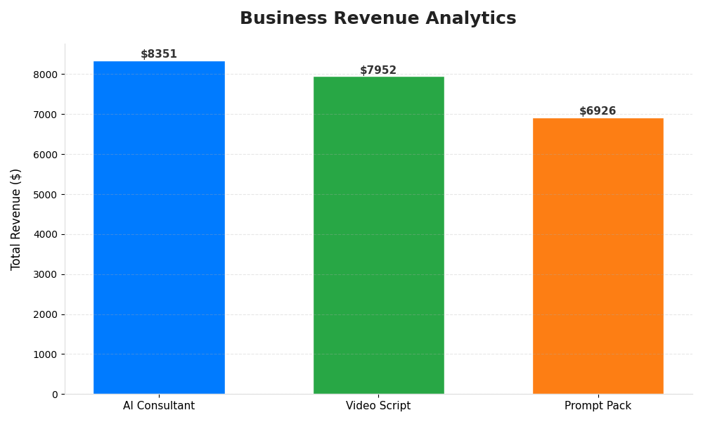

# 🚀 Business Intelligence & Data Automation Pipeline

Welcome to my **Active Lab**. This project is a functional demonstration of an automated end-to-end data pipeline designed to solve real-world business reporting challenges.

## 📌 Project Overview
In a fast-paced business environment, manual data entry and analysis are bottlenecks. This project automates the **ETL (Extract, Transform, Load)** process, turning messy raw transaction data into clean, actionable visual insights with a single execution.

### Key Features:
* **Automated Data Extraction:** Seamlessly reads raw CSV/Source data.
* **Smart Data Cleaning:** Intelligent filtering (e.g., separating 'Paid' vs 'Pending' transactions) to ensure data integrity.
* **Advanced Analytics:** Automated calculation of revenue distribution, product performance, and growth trends.
* **High-Fidelity Visualization:** Generates professional-grade charts for executive decision-making.

---

## 📊 Automated Reporting Output
This chart was generated automatically by the pipeline, featuring high-DPI rendering and modern data visualization standards.

> **Metric Insight:** The system identifies top-performing products and revenue leaks in real-time, reducing manual reporting time by approximately **90%**.

---

## 🛠️ Tech Stack & Tools
* **Language:** Python 3.x
* **Data Processing:** Pandas, NumPy
* **Visualization:** Matplotlib (Modern UI styling)
* **Environment:** Virtualenv for scalable deployment

## ⚙️ How It Works
1. **Source:** The pipeline ingests `raw_business_data.csv`.
2. **Process:** Python scripts handle cleaning, grouping, and statistical analysis.
3. **Output:** A clean summary is printed to the console, and a professional `.png` report is exported.

---
*Developed by [Widyobumi](https://github.com/widyobumi) — AI & Data Automation Enthusiast.*